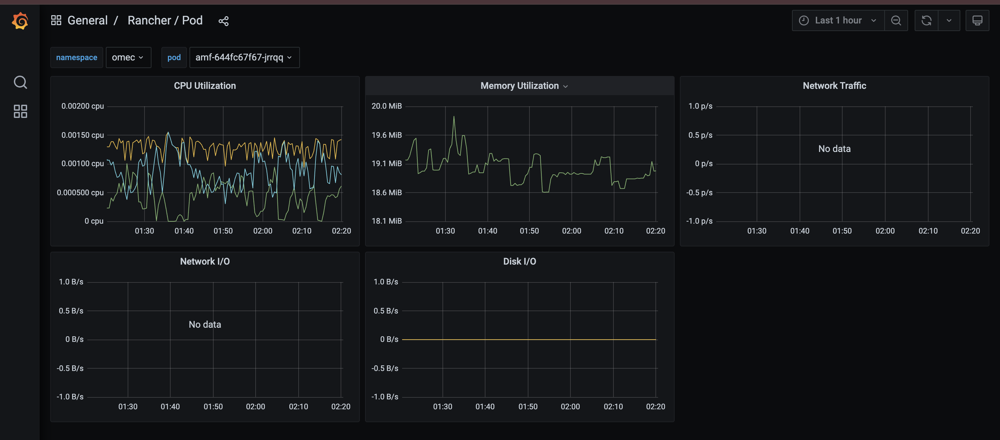
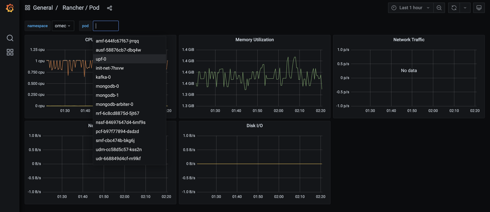

### Metric Collection and Visualization

**Metric collection** is vital for 5G network slicing as it enables real-time monitoring, optimization, and management of individual slices, ensuring that each meets its specific service-level agreements (SLAs) and quality of service (QoS) requirements. By collecting performance data such as latency, throughput, and resource utilization, operators can dynamically allocate resources, ensure slice isolation, and detect issues like bottlenecks. Metrics also support automation, allowing for dynamic scaling, proactive fault detection, and AI-driven optimizations, ultimately enhancing service reliability, efficiency, and user experience across various slices tailored for different applications like IoT, eMBB, and URLLC.

**Prometheus** is an open-source system monitoring and alerting tool used for collecting and querying metrics from various applications and systems. **Grafana** is often used in conjunction with Prometheus to visualize these metrics in the form of dashboards. In the context of OpenAirInterface (OAI), srsRAN, and Aether, Prometheus and Grafana can be used for real-time monitoring of various system and network metrics, such as CPU utilization, memory usage, disk I/O, network traffic, and more.

Prometheus plays a crucial role in collecting metrics from various components within **OpenAirInterface (OAI) 5G Core**, **RAN**, and **srsRAN** setups by scraping data from HTTP endpoints exposed by these components. These metrics include system performance data such as CPU and memory usage, along with network-specific metrics like packet loss, throughput, latency, and handover events. In the case of OAI and srsRAN, Prometheus gathers metrics from components like eNodeB or gNodeB (for the RAN), and the Core Network components such as MME, AMF, SMF, and UPF. Aether, an edge cloud orchestration platform, also utilizes Prometheus for monitoring Kubernetes pods, edge computing resources, and network services. Metrics related to network slicing, latency, and service quality across different slices can be efficiently collected and monitored.

Once Prometheus scrapes the metrics, **Grafana** can be used to visualize this data in real-time through dashboards. For OAI and srsRAN, these dashboards can provide valuable insights into the performance of gNB and eNB, including uplink/downlink throughput and signal quality, as well as Core Network metrics such as AMF, SMF, and UPF resource utilization and session management. Custom Grafana dashboards can be configured to focus on specific metrics of interest like user throughput, handover success rates, and CPU usage during peak loads. These dashboards allow for real-time monitoring of traffic across user planes, dropped packets, network I/O, and more, offering a comprehensive view of system health and performance, as demonstrated in the screenshots.

## Installation and Integration

### Installing and Integrating Prometheus and Grafana in XCP-ng VMs with OAI, srsRAN, and Aether

This tutorial walks through the installation and integration process of Prometheus and Grafana in XCP-ng VMs where OAI, srsRAN, and Aether are installed.

### Install Prometheus

1. **Update the system and install dependencies:**
   ```bash
   sudo apt update && sudo apt upgrade -y
   sudo apt install wget tar -y
   ```

2. **Download Prometheus:**
   ```bash
   wget https://github.com/prometheus/prometheus/releases/download/v2.53.2/prometheus-2.53.2.linux-amd64.tar.gz
   ```

3. **Extract and move Prometheus binaries:**
   ```bash
   tar xvfz prometheus-2.x.x.linux-amd64.tar.gz
   cd prometheus-2.x.x.linux-amd64
   sudo cp prometheus /usr/local/bin/
   sudo cp promtool /usr/local/bin/
   ```

4. **Create configuration files and directories:**
   ```bash
   sudo mkdir /etc/prometheus
   sudo mkdir /var/lib/prometheus
   sudo cp prometheus.yml /etc/prometheus/
   ```

5. **Configure Prometheus to scrape metrics from OAI, srsRAN, and Aether components:**
   Edit the `prometheus.yml` configuration file to define scrape jobs for OAI, srsRAN, and Aether services.

6. **Start Prometheus:**
   ```bash
   prometheus --config.file=/etc/prometheus/prometheus.yml
   ```
   Prometheus should now be up and running, scraping metrics from the specified targets.

### Set Up Grafana in an XCP-ng VM

1. **Provision a VM for Grafana:**
   Create a VM for Grafana using XCP-ng Center or Xen Orchestra. Ensure sufficient resources for visualization tasks.

2. **Install Grafana:**
   ```bash
   sudo apt update
   sudo apt install -y software-properties-common
   sudo add-apt-repository "deb https://packages.grafana.com/oss/deb stable main"
   sudo apt update
   sudo apt install grafana
   ```

3. **Start the Grafana service:**
   ```bash
   sudo systemctl start grafana-server
   sudo systemctl enable grafana-server
   ```

4. **Access Grafana:**
   Open a web browser and go to `http://<grafana-vm-ip>:3000`.

   Log in with the default credentials: `username: admin`, `password: admin` (you’ll be prompted to change this).

### Integrating Prometheus with Grafana

1. **Add Prometheus as a Data Source in Grafana:**

   In the Grafana UI, navigate to `Configuration > Data Sources` and click `Add Data Source`.

   Choose **Prometheus** as the data source type. Enter the URL of the Prometheus server (running in the other VM):

   ```
   http://<prometheus-vm-ip>:9090
   ```

   Click `Save & Test` to ensure Grafana can connect to Prometheus.

2. **Create Dashboards in Grafana:**

   Create a new dashboard by clicking `Create > Dashboard` in the Grafana UI. Customize the dashboard by adding multiple panels for different components (AMF, SMF, UPF, eNB, gNB, etc.), and visualize CPU, memory, and network performance across your infrastructure. Save the dashboard for continuous monitoring of your 5G network.

### Configure OAI, srsRAN, and Aether to Expose Metrics

- **OAI (OpenAirInterface)**: Modify the configuration files for OAI components (e.g., AMF, SMF, UPF) to expose metrics via HTTP endpoints. For example, OAI can expose metrics on port 9090. Ensure that each component’s yaml or conf file includes a Prometheus section to allow scraping.

- **srsRAN**: For srsRAN, you may need to modify the configuration or use a Prometheus Exporter that allows exposing system and network metrics (CPU, packet loss, throughput). Set up a Prometheus scrape endpoint on srsRAN components such as gNodeB.

- **Aether**: Aether typically uses Kubernetes for edge orchestration, and Kubernetes nodes expose node-exporter metrics that Prometheus can scrape. Install Prometheus node-exporter on the Aether VM to collect system metrics:
   ```bash
   sudo apt install prometheus-node-exporter
   ```

By deploying Prometheus and Grafana in XCP-ng VMs, you can effectively monitor and visualize the performance of your OAI, srsRAN, and Aether installations. Prometheus collects metrics from various 5G core and RAN components, while Grafana provides real-time visualization and alerts to ensure your network is operating optimally.

### Grafana Dashboards

In the below screenshot, we see a Grafana dashboard giving an overview of the system's CPU, memory, and disk utilization for a specific cluster or node. This dashboard is useful for gaining a quick insight into overall system resource usage, including CPU, memory, and disk usage. It allows you to understand the load on your infrastructure.


In the below screenshot, Grafana is displaying performance metrics for a specific Kubernetes pod, likely part of the OpenAirInterface (OAI) or srsRAN setup. The pod in question is `amf-644fc6f7f67-jrrqq` (AMF stands for Access and Mobility Management Function in 5G Core).

This dashboard shows metrics for another Kubernetes pod, specifically the `upf-0` pod, which is the User Plane Function (UPF) in 5G Core.

This screenshot shows a pod selector feature where you can pick different pods within the OMEC namespace and view their performance metrics.

The dropdown list includes other pods such as:
- `amf-644fc6f7f67-jrrqq` (AMF pod)
- `upf-0` (UPF pod)
- Other components such as `mongodb-0`, `smf`, `udm`, and `nrf`, which are part of the 5G core network infrastructure.

These Grafana dashboards offer comprehensive insights into the performance and resource usage of the overall system within 5G Core setup. Monitoring key metrics like CPU, memory, and disk usage helps ensure that the infrastructure is functioning efficiently and provides the necessary performance data to optimize the system.

By deploying Prometheus and Grafana in VMs, you can effectively monitor and visualize the performance of your OAI, srsRAN, and Aether installations. Prometheus collects metrics from various 5G core and RAN components, while Grafana provides real-time visualization and alerts to ensure your network is operating optimally.
```

